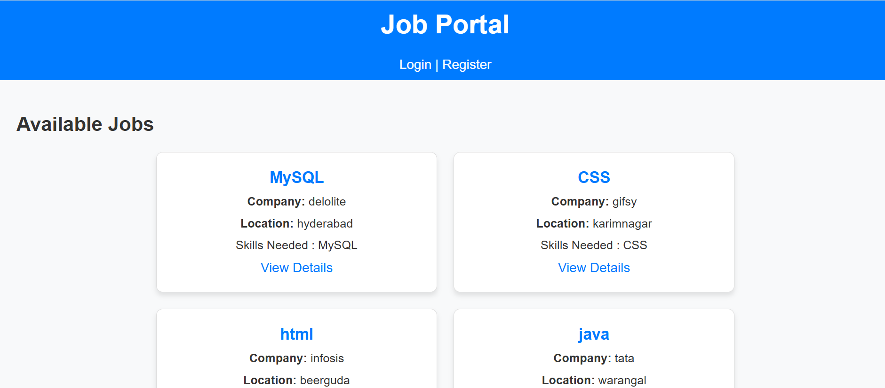
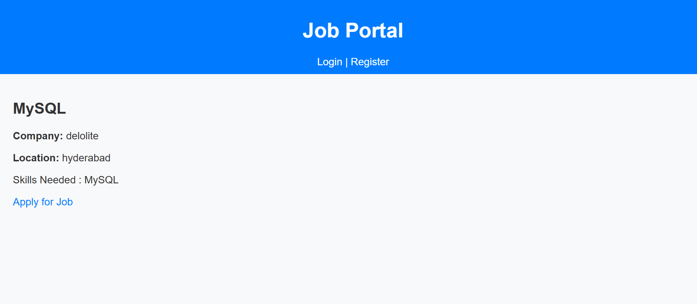
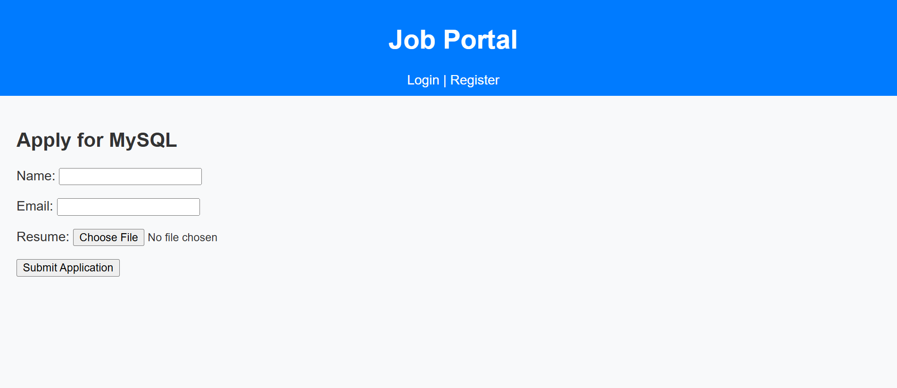
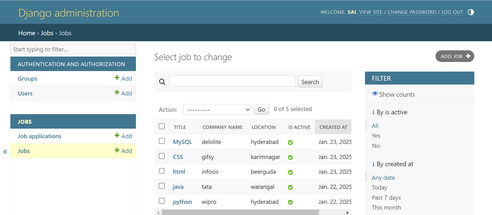
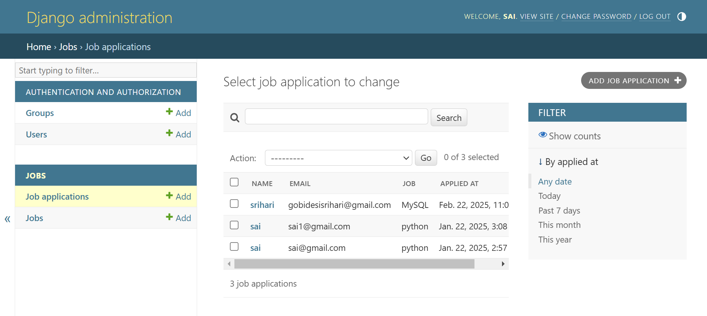
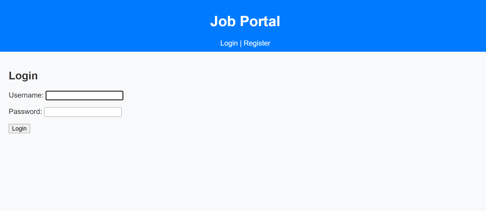
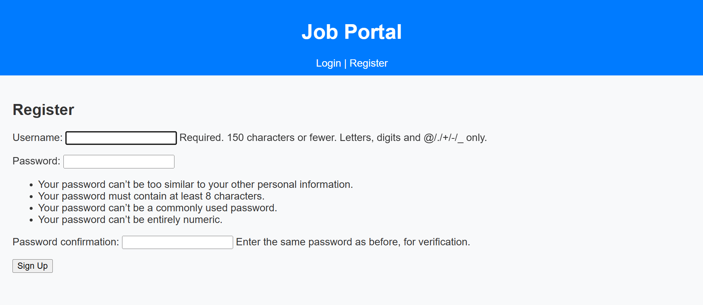

# 💼 Job Portal Project

<div align="center" style="background-color:#0D1117; padding: 20px; border-radius: 10px;">


</div>

## 📖 About the Project

This is a **Job Portal** built using **Django (Python)**, **HTML**, **CSS**, and **MySQL**. It enables employers to post job listings and job seekers to apply for jobs. The project includes user authentication and a fully responsive interface.

---

## 📋 Features

- ✔️ User authentication (Login & Registration)  
- ✔️ Employer job posting & management  
- ✔️ Job seeker profile creation & job application  
- ✔️ Admin dashboard for managing users & jobs  
- ✔️ Search & filter job listings  
- ✔️ Responsive design for all devices  
- ✔️ Secure password handling using Django's authentication system  

---

## 🖼️ Screenshots


### Job Listings


### Job Details Page


### Job Apply Page


### Admin Panel for Jobs


### Admin Panel for JobApplications




### Login Page


### Registration Page


---

## 🛠️ Tech Stack

<div align="left">
  
  
  
  
  
  
  
  
  
</div>

---

## 📂 Setup

To run this project locally, follow these steps:

```bash
# Clone the repository
git clone https://github.com/your-username/job-portal.git

# Navigate to the project directory
cd job-portal

# Create a virtual environment
python -m venv venv

# Activate the virtual environment
# On Windows
venv\Scripts\activate
# On Linux/Mac
source venv/bin/activate

# Install dependencies
pip install -r requirements.txt

# Apply migrations
python manage.py migrate

# Create a superuser
python manage.py createsuperuser

# Run the development server
python manage.py runserver

# Access the application at:
http://localhost:8000
```

---

## 📊 Database Schema

- **Users**: Stores user credentials and roles (Employer, Job Seeker, Admin)
- **Jobs**: Contains job details such as title, description, location, etc.
- **Applications**: Tracks job applications with user and job references
- **Profiles**: Stores additional user information (for job seekers)

---

## 📌 Future Enhancements

- Implement job recommendation system
- Add email notifications for applications
- Support for resume upload & parsing
- Enhanced search with AI-powered suggestions

---

## 🔗 Connect with Me

<div align="left">
  <a href="mailto:saivivekgundeti7881@gmail.com">
    
  </a>
  <a href="https://www.instagram.com/_im_vivek_._" target="_blank">
    
  </a>
</div>

